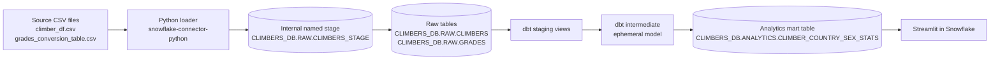
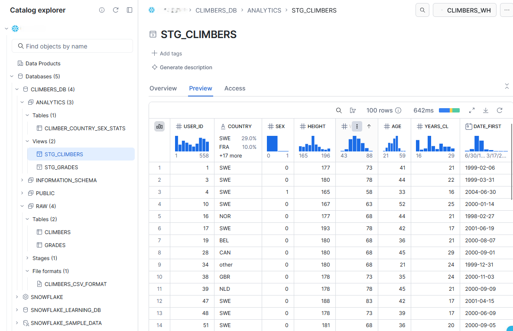
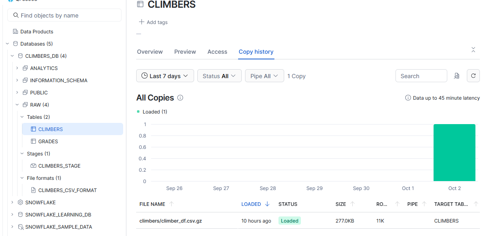
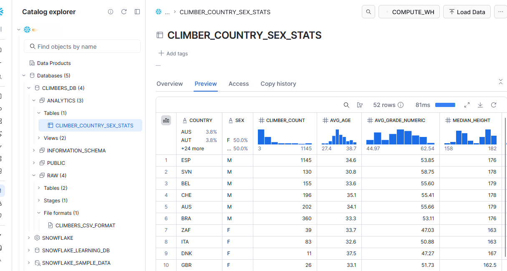
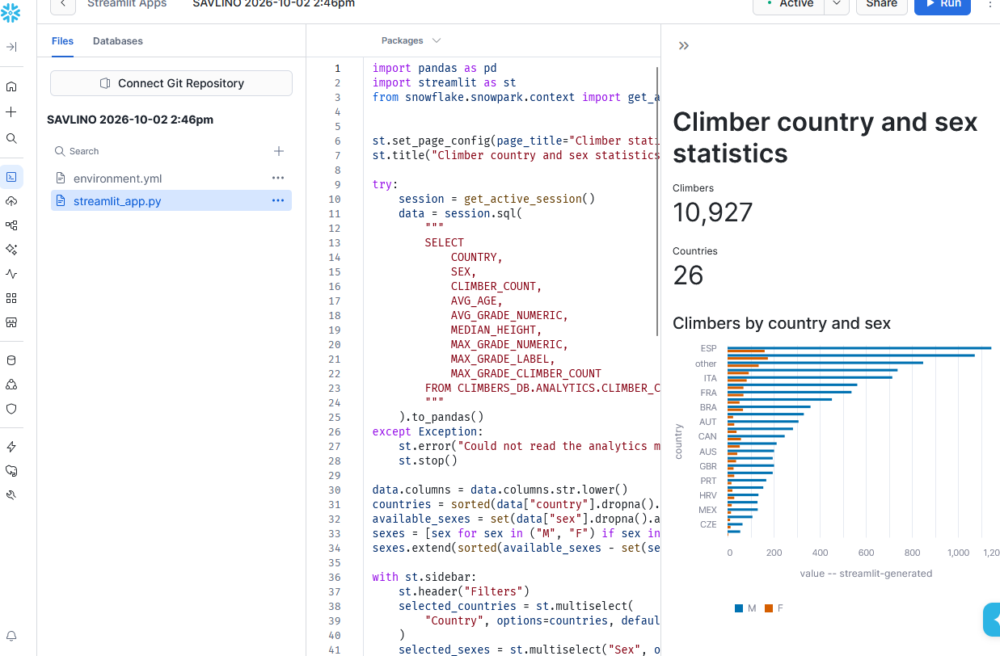
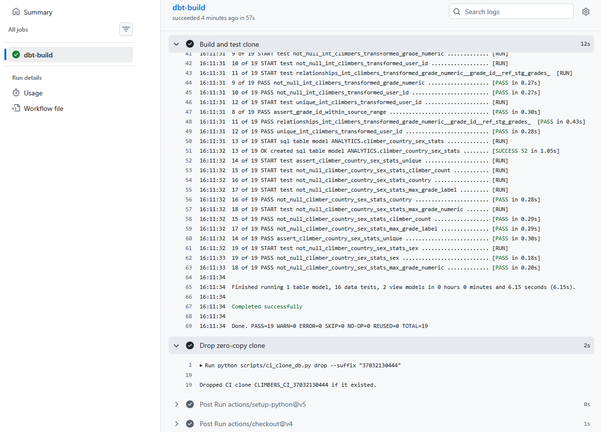
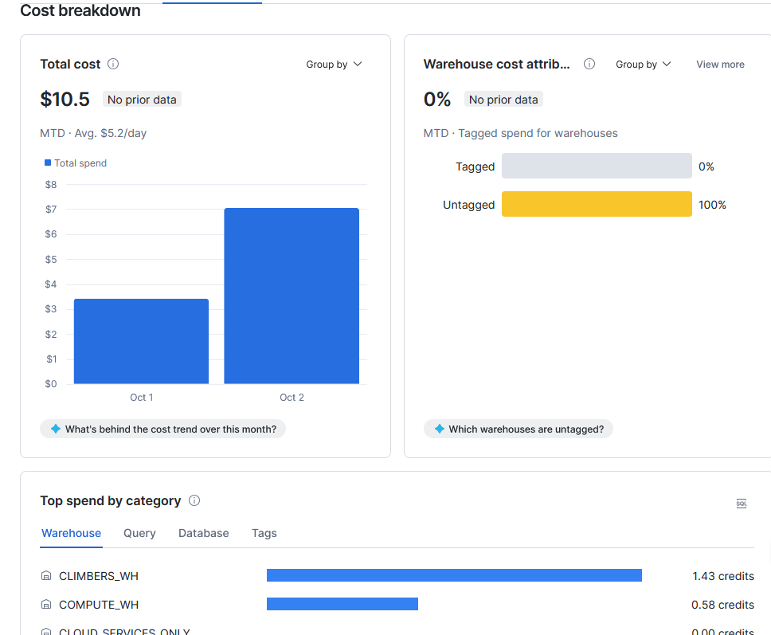
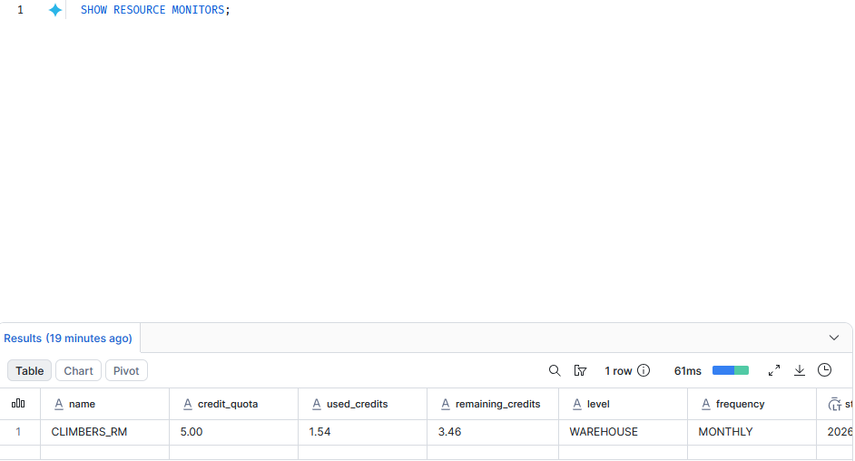
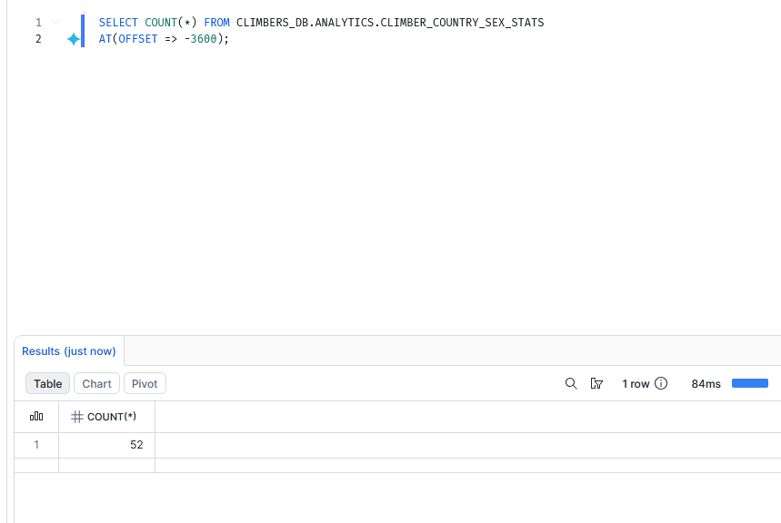

# Climbers Snowflake dbt Pipeline

A Snowflake and dbt pipeline for the Kaggle [Climb Dataset](https://www.kaggle.com/datasets/jordizar/climb-dataset), based on the 8a.nu logbook. A Python loader uploads the two source CSV files to an internal stage, Snowflake loads them into raw tables, and dbt builds the `climber_country_sex_stats` analytics mart. A Streamlit in Snowflake app reads the mart through its active Snowflake session.

## Architecture


Catalog structure in Snowsight — raw tables with their stage and file format, staging views, and the analytics mart, all under `CLIMBERS_DB`:



## Prerequisites

- Python 3.11 or later
- A Snowflake account with permission to create the required role, service user, warehouse, resource monitor, database, schemas, stage, and file format
- Internet access to download the public Kaggle dataset automatically, or local copies of `climber_df.csv` and `grades_conversion_table.csv`
- An RSA key pair for `CLIMBERS_SVC`; keep the private key outside this repository
- GitHub repository secrets for the Snowflake CI workflow

Run [`snowflake/setup.sql`](snowflake/setup.sql) manually as `ACCOUNTADMIN`. Confirm that its `RSA_PUBLIC_KEY` matches the public key for your private key, and verify the required privileges on the actual trial account before running it.

## Quick Start

Create a virtual environment and install the loader, export, and dbt dependencies:

```powershell
python -m venv .venv
.\.venv\Scripts\Activate.ps1
python -m pip install -r requirements-dev.txt dbt-snowflake
```

Create `.env` from the template, then set your account identifier, key path, and key passphrase locally. Never commit `.env` or the private key.

```powershell
Copy-Item .env.example .env
```

Load the environment values into the current PowerShell process:

```powershell
Get-Content .env | ForEach-Object {
    if ($_ -match '^\s*([^#][^=]*)=(.*)$') {
        [Environment]::SetEnvironmentVariable(
            $matches[1].Trim(),
            $matches[2].Trim().Trim('"').Trim("'"),
            'Process'
        )
    }
}
```

Copy the dbt profile template. The source database follows the active profile target, so the same project configuration works against the CI clone.

```powershell
Copy-Item dbt\profiles.yml.example dbt\profiles.yml
```

Load the latest CSV files from Kaggle into the raw tables:

```powershell
.\.venv\Scripts\python.exe loaders\load_to_snowflake.py
```

To use CSVs already downloaded locally, pass their containing directory with `--source-dir`:

```powershell
.\.venv\Scripts\python.exe loaders\load_to_snowflake.py --source-dir "C:\path\to\climb-dataset"
```

Install dbt packages, build the models, and run the configured tests:

```powershell
dbt deps --project-dir dbt --profiles-dir dbt
dbt build --project-dir dbt --profiles-dir dbt
```

## Data Model

The loader uploads both CSVs to `CLIMBERS_DB.RAW.CLIMBERS_STAGE` and replaces the raw tables before each load:

- `CLIMBERS_DB.RAW.CLIMBERS`
- `CLIMBERS_DB.RAW.GRADES`

The named CSV file format skips the header, supports optionally quoted fields, and treats empty fields as `NULL`. The loader uses `PUT` with `OVERWRITE = TRUE`, then `COPY INTO` with `FORCE = TRUE`. Re-running it replaces the raw tables rather than appending duplicate rows.

dbt materializes staging models as views, the intermediate model as ephemeral, and the mart as a table. `CLIMBERS_DB.ANALYTICS.CLIMBER_COUNTRY_SEX_STATS` contains one row per `country, sex` with:

- `climber_count`
- `avg_age`
- `avg_grade_numeric`
- `median_height`, calculated with Snowflake's exact `MEDIAN` aggregate
- `max_grade_numeric`
- `max_grade_label`
- `max_grade_climber_count`

Copy history for the `CLIMBERS` raw table, confirming the file was loaded once with the expected row count:



## Sample Output

The checked-in files are the sample export artifacts. The CSV currently contains 52 country/sex rows; regenerate both files after a Snowflake `dbt build` to refresh them from the live mart. The exporter supports `--limit <rows>` to restrict the CSV rows used for the export.

- [CSV: climber_country_sex_stats.csv](sample_output/climber_country_sex_stats.csv)
- [Chart: top_countries_by_climbers.png](sample_output/top_countries_by_climbers.png)

The same result set, queried live in Snowsight:



```powershell
.\.venv\Scripts\python.exe scripts\export_sample_output.py
.\.venv\Scripts\python.exe scripts\export_sample_output.py --limit 10
```

Generated from a live pipeline run on 2026-10-02.

### Streamlit App Screenshot



## Tests

`dbt build` runs the model and test nodes. The configured tests cover:

- Non-null and unique staging keys
- Non-null mart fields
- The relationship between transformed numeric grades and `stg_grades.grade_id`
- The valid range of `grade_id`
- Uniqueness of the `country, sex` mart grain

Run `dbt test --project-dir dbt --profiles-dir dbt` separately when only the tests need to be rerun.

## CI

The GitHub Actions workflow runs on `pull_request` and `workflow_dispatch`. It creates a zero-copy clone named `CLIMBERS_CI_<suffix>`, sets `SNOWFLAKE_DATABASE` to that clone, runs `dbt deps` and `dbt build`, then attempts to drop the clone in an `if: always()` step. PR runs are serialized by concurrency group. The dbt source definition uses `target.database`, allowing it to resolve raw tables from the clone instead of the production database.

A successful PR run: `dbt build` and tests execute against the zero-copy clone, which is then dropped in the cleanup step:



Configure these repository secrets:

- `SNOWFLAKE_ACCOUNT`
- `SNOWFLAKE_USER`
- `SNOWFLAKE_ROLE`
- `SNOWFLAKE_WAREHOUSE`
- `SNOWFLAKE_PRIVATE_KEY` (the private key file contents)
- `SNOWFLAKE_PRIVATE_KEY_PASSPHRASE` (only for an encrypted private key)

The CI role needs `CREATE DATABASE ON ACCOUNT` and access to the source database so it can clone and drop the CI database. The cleanup command refuses to drop database names that do not start with `CLIMBERS_CI_`.

## Streamlit in Snowflake

The app uses `get_active_session()` and reads `CLIMBERS_DB.ANALYTICS.CLIMBER_COUNTRY_SEX_STATS`; it does not configure separate database credentials. Its `environment.yml` lists only Streamlit and pandas.

To deploy from Snowsight, open **Projects > Streamlit > + Streamlit App**, create the app in `CLIMBERS_DB.ANALYTICS`, choose **Run on warehouse** and `CLIMBERS_WH`, upload `streamlit/app.py` and `streamlit/environment.yml`, then select **Run**. The role used by the app needs access to the warehouse and mart.

## Why Snowflake + dbt

- **Separate storage and compute.** The project uses a dedicated XSMALL warehouse with auto-suspend after 60 seconds and auto-resume, tracked separately from the account's default warehouse in Cost Management. A monthly five-credit resource monitor caps spend on the warehouse:

  

```sql
  SHOW RESOURCE MONITORS;
```

  

- **Isolated CI with zero-copy clones.** Each PR gets a separate clone of the source database without a second full storage copy, keeping CI changes away from the main database.

- **Time Travel for the mart.** Snowflake can query an earlier table state within the configured retention window:

```sql
  SELECT COUNT(*)
  FROM CLIMBERS_DB.ANALYTICS.CLIMBER_COUNTRY_SEX_STATS
  AT(OFFSET => -3600);
```

  

- **Streamlit alongside the data.** The app runs in Snowflake and uses its active session, without separate app hosting or separate database credentials.

- **Exact aggregation and scoped access.** The mart uses exact `MEDIAN`; the service user authenticates with a key pair and receives a dedicated role for RBAC.

## Related Implementations

| Stack | Orchestration | Storage | How the result is shown |
|---|---|---|---|
| Snowflake, Python, dbt, Streamlit | GitHub Actions PR clone workflow; local loader and dbt commands | Snowflake internal stage and raw/analytics tables | Streamlit in Snowflake, plus CSV and PNG sample exports |
| [Airflow implementation](https://github.com/savlino/airflow_climbers_data): Airflow, PostgreSQL, PySpark | Manually triggered Airflow DAGs; GitHub Actions tests | PostgreSQL warehouse | Sample CSV/PNG and table inspection in DBeaver |
| [Databricks implementation](https://github.com/savlino/databricks_dbt_data_pipeline): Python, dbt | Manually triggered GitHub Actions workflow | Delta tables in Unity Catalog | Catalog Explorer and CSV/PNG sample exports |

## Project Structure

```text
.
├── .github/workflows/ci.yml
├── assets/
│   ├── catalog_structure.png
│   ├── climber_country_sex_stats_live.png
│   ├── climbers_copy_history.png
│   ├── cost_management.png
│   ├── github_actions_run_result.png
│   ├── resource_monitor.png
│   ├── streamlit_app.png
│   └── time_travel_query.png
├── dbt/
│   ├── models/
│   │   ├── intermediate/int_climbers_transformed.sql
│   │   ├── marts/climber_country_sex_stats.sql
│   │   └── staging/
│   │       ├── schema.yml
│   │       ├── stg_climbers.sql
│   │       └── stg_grades.sql
│   ├── dbt_project.yml
│   ├── profiles.yml.example
│   └── tests/
│       ├── assert_climber_country_sex_stats_unique.sql
│       └── assert_grade_id_within_source_range.sql
├── loaders/
│   └── load_to_snowflake.py
├── sample_output/
│   ├── climber_country_sex_stats.csv
│   └── top_countries_by_climbers.png
├── scripts/
│   ├── ci_clone_db.py
│   └── export_sample_output.py
├── snowflake/setup.sql
├── streamlit/
│   ├── app.py
│   └── environment.yml
├── .env.example
├── .gitignore
├── README.md
├── LICENSE
└── requirements-dev.txt
```

## License

This project is licensed under the MIT License. See [LICENSE](LICENSE) for details.